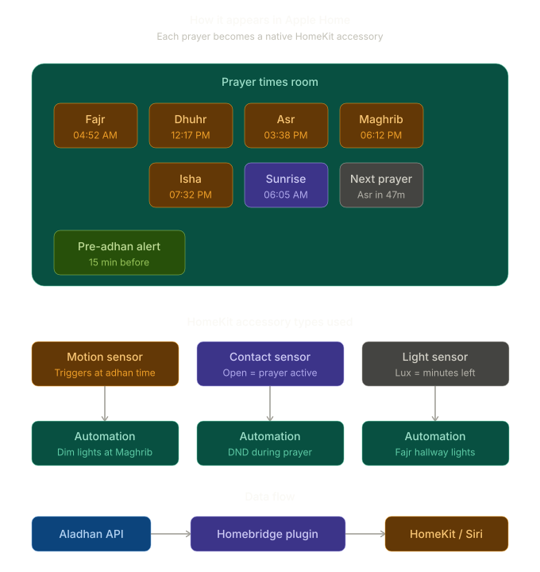

<p align="center">


</p>

<p align="center">
<a href="https://github.com/homebridge/homebridge/wiki/Verified-Plugins"></a>
<a href="https://www.npmjs.com/package/homebridge-prayer-times"></a>
<a href="https://www.npmjs.com/package/homebridge-prayer-times"></a>
<a href="https://github.com/aziz66/homebridge-prayer-times/stargazers"></a>
<br>
<a href="https://github.com/aziz66/homebridge-prayer-times/issues"></a>
<a href="https://github.com/aziz66/homebridge-prayer-times"></a>
<a href="https://github.com/aziz66/homebridge-prayer-times/releases"></a>
<br>
<a href="https://www.npmjs.com/package/homebridge-prayer-times"></a>
<a href="https://www.npmjs.com/package/homebridge-prayer-times"></a>
<a href="https://ko-fi.com/aziz66"></a>
</p>

# homebridge-prayer-times

Islamic prayer times as HomeKit sensors. Automate your home around salah times — dim lights at Maghrib, turn on lights at Fajr, and more.

## What It Does

This Homebridge plugin fetches daily Islamic prayer times from the [AlAdhan API](https://aladhan.com) and exposes them as HomeKit motion and contact sensors. Since prayer times shift daily based on astronomical calculations, fixed-time HomeKit automations don't work — this plugin solves that.

Each prayer creates a **motion sensor** (triggers automations at adhan time) and a **contact sensor** (stays open for a configurable prayer window).

## How It Appears in Apple Home

<p align="center">
  
</p>

Each prayer appears as a native HomeKit accessory in your Home app. The plugin uses three types of sensors:

- **Motion Sensor** — triggers at adhan time, stays active for `motionDuration` minutes. This is what drives your automations.
- **Contact Sensor** — opens at adhan time, stays open for `windowDuration` minutes. Use for conditional automations like "while prayer window is open, keep lights dim."
- **Light Sensor** *(optional)* — shows minutes until the next prayer as a lux value. Enables threshold automations like "when countdown < 10, flash a light."

Optional **pre-adhan alert** sensors trigger before each prayer to give you a heads-up.

## Example Automations

- **Fajr** motion detected → turn on hallway lights at 20%
- **Maghrib** motion detected → set living room to warm dim
- **Isha** motion detected → activate night mode scene
- **Sunrise** motion detected → open smart blinds
- **Dhuhr** contact open → set phone to Do Not Disturb (via Shortcuts)
- 15 min before **Dhuhr** → flash office light briefly (pre-adhan alert)
- During Ramadan: **Fajr** motion → turn on kitchen lights for suhoor

## Installation

### Via Homebridge UI (Recommended)

Search for `homebridge-prayer-times` in the Homebridge plugin tab and click Install.

### Via npm

```bash
npm install -g homebridge-prayer-times
```

## Configuration

Configure via the Homebridge UI settings form, or add manually to `config.json`:

```json
{
  "platforms": [
    {
      "platform": "PrayerTimes",
      "name": "Prayer Times",
      "location": {
        "mode": "city",
        "city": "Dubai",
        "country": "United Arab Emirates"
      },
      "calculationMethod": 4,
      "school": 0,
      "motionDuration": 30,
      "windowDuration": 30,
      "preAdhanAlert": false,
      "preAdhanMinutes": 15,
      "showCountdown": false
    }
  ]
}
```

### Location Modes

- **City & Country** — simple, just enter your city and country names
- **Coordinates** — use latitude/longitude for precise location

```json
"location": {
  "mode": "coordinates",
  "latitude": 25.2048,
  "longitude": 55.2708
}
```

### Options

| Option | Default | Description |
|--------|---------|-------------|
| `calculationMethod` | 4 (Umm Al-Qura) | Prayer time calculation method |
| `school` | 0 (Shafi) | Asr calculation school |
| `timezone` | auto-detect | IANA timezone (e.g. `Asia/Dubai`) |
| `motionDuration` | 30 | Minutes the motion sensor stays active after adhan |
| `windowDuration` | 30 | Minutes the contact sensor stays open after adhan |
| `preAdhanAlert` | false | Create sensors that trigger before each prayer |
| `preAdhanMinutes` | 15 | Minutes before prayer for pre-adhan alert |
| `showCountdown` | false | Light sensor showing minutes until next prayer |
| `prayers.fajr` | true | Enable/disable individual prayers |

### Sensor Behavior

| Time | Motion Sensor | Contact Sensor |
|------|---------------|----------------|
| Before prayer | `false` | Closed |
| At adhan time | `true` (for `motionDuration` min) | Open (for `windowDuration` min) |
| After window ends | `false` | Closed |

Both `motionDuration` and `windowDuration` can be configured independently. For example, you might want the motion trigger to last 5 minutes (just to fire automations) but the contact window to stay open for 60 minutes (to represent the prayer period).

## How It Works

1. At startup and daily at 00:05, the plugin fetches prayer times from the AlAdhan API
2. Times are cached to disk so restarts don't require new API calls
3. For each enabled prayer, a `setTimeout` is scheduled
4. When the timer fires, the **motion sensor** triggers (stays active for `motionDuration` minutes)
5. The **contact sensor** opens at adhan time and closes after `windowDuration` minutes
6. HomeKit automations respond to these sensor state changes
7. If Homebridge restarts mid-day, sensors resume their correct state based on elapsed time

## Calculation Methods

| ID | Method | Region |
|----|--------|--------|
| 2 | Islamic Society of North America (ISNA) | North America |
| 3 | Muslim World League (MWL) | Europe, Far East |
| 4 | Umm Al-Qura University, Makkah | Arabian Peninsula |
| 5 | Egyptian General Authority of Survey | Africa, Middle East |
| 7 | Institute of Geophysics, University of Tehran | Iran |
| 8 | Gulf Region | UAE, Qatar, Kuwait, Bahrain |
| 9 | Kuwait | Kuwait |
| 10 | Qatar | Qatar |
| 11 | Majlis Ugama Islam Singapura (MUIS) | Singapore |
| 12 | Union des Organisations Islamiques de France | France |
| 13 | Diyanet Isleri Baskanligi | Turkey |
| 14 | Spiritual Administration of Muslims of Russia | Russia |
| 15 | Moonsighting Committee | Worldwide |
| 16 | Dubai (unofficial) | Dubai |
| 17 | JAKIM | Malaysia |
| 18 | Tunisia | Tunisia |
| 19 | Algeria | Algeria |
| 20 | KEMENAG | Indonesia |
| 21 | Morocco | Morocco |
| 22 | Portugal | Portugal |
| 23 | Jordan | Jordan |
| 1 | University of Islamic Sciences, Karachi | Pakistan |
| 0 | Shia Ithna-Ashari | Shia communities |

## Troubleshooting

**No accessories appear**
- Ensure you have configured a location (city/country or coordinates) in the plugin settings
- Check Homebridge logs for error messages

**Prayer times seem wrong**
- Verify your calculation method matches your region
- Check your timezone setting (or leave blank for auto-detect)
- Hanafi users: set school to 1 for later Asr time

**API errors**
- The plugin retries with escalating backoff (5min, then 30min, then hourly) until it succeeds
- Cached times are used as a fallback while retrying
- Check your internet connection
- The AlAdhan API is free and doesn't require authentication

**Sensors stuck or not updating**
- Restart Homebridge — the plugin will re-fetch times and reschedule all sensors
- All sensor states reset cleanly at the daily 00:05 refresh

## Credits

Prayer times provided by the [AlAdhan API](https://aladhan.com) — free, open, and no API key required.

## License

Apache-2.0
